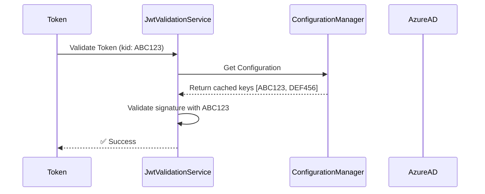
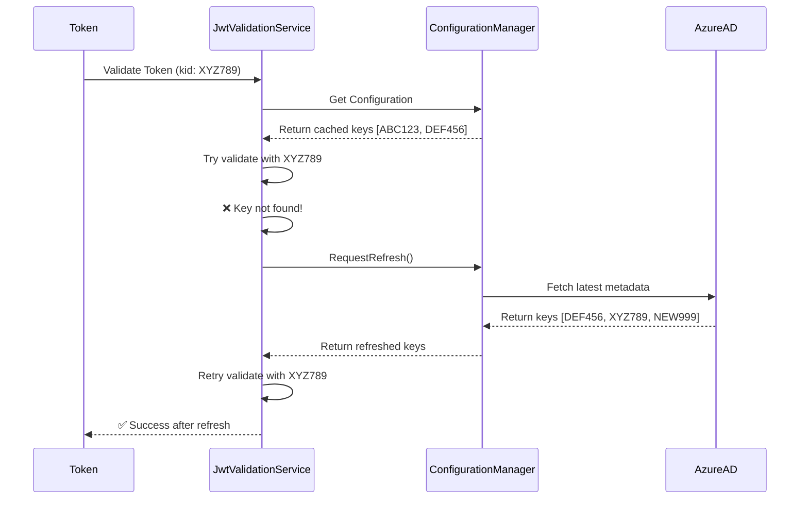

# JWT Token Signature Key Rotation Fix

## Issue Summary

**Error**: `Microsoft.IdentityModel.Tokens.SecurityTokenSignatureKeyNotFoundException`  
**Location**: `JwtValidationService.ValidateJwtTokenAsync` (line 137)  
**Impact**: Authentication failures when Microsoft Entra ID rotates signing keys

## Problem Statement

The application was experiencing authentication failures with the following error:

```
IDX10503: Signature validation failed. The token's kid is: 'Uo1a_QUweTFqiqL_HSeSjQIoRj0', 
but did not match any keys in TokenValidationParameters or Configuration.
```

This occurred because:

1. **No caching**: A new `ConfigurationManager` was created on every token validation call
2. **No automatic refresh**: The configuration manager lacked `AutomaticRefreshInterval` and `RefreshInterval` settings
3. **No retry logic**: When Azure AD rotated keys and a token with a new kid arrived, validation immediately failed
4. **Stale keys**: The application couldn't automatically fetch updated signing keys from Azure AD

## Root Cause Analysis

### Original Implementation (Problematic)

```csharp
private async Task<ClaimsPrincipal?> ValidateJwtTokenAsync(string token)
{
    // ... configuration setup ...
    
    // ❌ Problem: New ConfigurationManager created on every call
    var configurationManager = new ConfigurationManager<OpenIdConnectConfiguration>(
        openIdMetadataUrl,
        new OpenIdConnectConfigurationRetriever());
    
    var openIdConfig = await configurationManager.GetConfigurationAsync(CancellationToken.None);
    
    // ... validation parameters setup ...
    
    // ❌ Problem: No retry logic when key is not found
    var principal = _tokenHandler.ValidateToken(token, validationParameters, out SecurityToken validatedToken);
    
    return principal;
}
```

### Issues Identified

1. **New instance per validation**: Each call created a fresh `ConfigurationManager`, preventing caching
2. **Missing refresh configuration**: No `AutomaticRefreshInterval` or `RefreshInterval` properties
3. **No exception handling**: `SecurityTokenSignatureKeyNotFoundException` was not caught or handled
4. **No refresh trigger**: No mechanism to force metadata refresh when keys don't match

## Solution Implementation

### Key Changes

1. **Singleton ConfigurationManager** with thread-safe lazy initialization
2. **Automatic refresh intervals** matching Program.cs configuration
3. **Retry logic** to handle key rotation events
4. **Comprehensive logging** for debugging

### New Implementation

```csharp
public class JwtValidationService : IJwtValidationService
{
    // ✅ Singleton instance with proper locking
    private ConfigurationManager<OpenIdConnectConfiguration>? _configurationManager;
    private readonly SemaphoreSlim _configurationManagerLock = new(1, 1);
    
    // ✅ Thread-safe lazy initialization
    private async Task<ConfigurationManager<OpenIdConnectConfiguration>> GetOrCreateConfigurationManagerAsync()
    {
        if (_configurationManager != null)
        {
            return _configurationManager;
        }

        await _configurationManagerLock.WaitAsync();
        try
        {
            // Double-check after acquiring lock
            if (_configurationManager != null)
            {
                return _configurationManager;
            }

            // ... metadata URL configuration ...

            // ✅ Configure with automatic refresh settings
            _configurationManager = new ConfigurationManager<OpenIdConnectConfiguration>(
                openIdMetadataUrl,
                new OpenIdConnectConfigurationRetriever(),
                new HttpDocumentRetriever())
            {
                // Refresh metadata every 6 hours (proactive)
                AutomaticRefreshInterval = TimeSpan.FromHours(6),
                // Minimum 30 minutes between refreshes (rate limiting)
                RefreshInterval = TimeSpan.FromMinutes(30)
            };

            return _configurationManager;
        }
        finally
        {
            _configurationManagerLock.Release();
        }
    }

    private async Task<ClaimsPrincipal?> ValidateJwtTokenAsync(string token)
    {
        // ... configuration setup ...

        // ✅ Get singleton configuration manager
        var configurationManager = await GetOrCreateConfigurationManagerAsync();

        // ✅ Try validation with current configuration
        try
        {
            var openIdConfig = await configurationManager.GetConfigurationAsync(CancellationToken.None);
            
            // ... validation parameters setup ...
            
            var principal = _tokenHandler.ValidateToken(token, validationParameters, out SecurityToken validatedToken);
            return principal;
        }
        catch (SecurityTokenSignatureKeyNotFoundException ex)
        {
            // ✅ Retry logic: Force refresh and retry validation
            _logger.LogWarning(ex, "Signing key not found in current configuration. Attempting to refresh metadata and retry validation.");
            
            configurationManager.RequestRefresh();
            var refreshedConfig = await configurationManager.GetConfigurationAsync(CancellationToken.None);

            // ... rebuild validation parameters with refreshed keys ...
            
            var principal = _tokenHandler.ValidateToken(token, validationParameters, out SecurityToken validatedToken);
            return principal;
        }
    }
}
```

## How It Works

### Normal Flow (Key Already Cached)



### Key Rotation Flow (New Key Required)



### Automatic Refresh (Proactive)

The `AutomaticRefreshInterval` of 6 hours ensures keys are proactively updated:

```
Time 0h:  Initial fetch of keys [ABC123, DEF456]
Time 6h:  Automatic refresh → keys [DEF456, XYZ789, NEW999]
Time 12h: Automatic refresh → keys [XYZ789, NEW999, NEXT111]
```

This reduces the likelihood of reactive refreshes during validation.

## Configuration

### Refresh Intervals

| Setting | Value | Purpose |
|---------|-------|---------|
| `AutomaticRefreshInterval` | 6 hours | Proactively refresh keys before they become stale |
| `RefreshInterval` | 30 minutes | Rate limit to prevent hammering the metadata endpoint |

These settings match the configuration used in:

- `ImageAPI/Program.cs`
- `InkStainedWretchFunctions/Program.cs`
- `InkStainedWretchStripe/Program.cs`

All use the same refresh strategy for consistency.

## Testing

### Unit Tests Added

Created 16 comprehensive unit tests in `OnePageAuthor.Test/Authentication/JwtValidationServiceTests.cs`:

1. ✅ Null token handling
2. ✅ Empty token handling
3. ✅ Whitespace token handling
4. ✅ Opaque token delegation to introspection service
5. ✅ Two-segment token rejection
6. ✅ Empty segment detection
7. ✅ Missing configuration handling
8. ✅ Missing tenant ID validation
9. ✅ Missing audience validation
10. ✅ Custom metadata URL support
11. ✅ Singleton ConfigurationManager behavior
12. ✅ Multiple concurrent validation calls
13-16. ✅ Various invalid token format tests

### Test Results

```
Passed!  - Failed: 0, Passed: 796, Skipped: 2, Total: 798
```

All existing tests continue to pass with the new implementation.

## Monitoring and Logging

The implementation includes comprehensive logging:

### Initialization

```
[Information] Initializing ConfigurationManager with metadata URL: https://login.microsoftonline.com/{tenant}/v2.0/.well-known/openid-configuration
```

### Normal Validation

```
[Debug] Attempting to validate JWT token with 3 segments
[Information] JWT token validated successfully for user: {UserId}
```

### Key Rotation Detected

```
[Warning] Signing key not found in current configuration. Attempting to refresh metadata and retry validation.
[Debug] Retrying JWT token validation with refreshed signing keys
[Information] JWT token validated successfully after metadata refresh for user: {UserId}
```

### Monitor These Logs

Set up Application Insights alerts for:

- Frequency of "refresh metadata and retry validation" messages
- Any repeated failures after retry
- Unusual patterns in key refresh timing

## Performance Impact

### Positive Impacts

- ✅ **Reduced metadata requests**: Singleton ConfigurationManager caches keys for 6 hours
- ✅ **Faster validation**: No repeated object initialization per request
- ✅ **Thread-safe**: Proper locking prevents race conditions

### Potential Latency

- ⚠️ **First request after key rotation**: ~200-500ms additional latency for metadata refresh
- ⚠️ **Subsequent requests**: No additional latency (keys are cached)

### Mitigation

The 6-hour automatic refresh interval means:

- Most key rotations are handled proactively
- Reactive refreshes (during validation) are rare
- Impact is limited to a single request per instance

## Comparison with Program.cs Approach

### Program.cs (ASP.NET Core Authentication)

```csharp
builder.Services
    .AddAuthentication(JwtBearerDefaults.AuthenticationScheme)
    .AddJwtBearer(options =>
    {
        options.RefreshOnIssuerKeyNotFound = true; // ✅ Built-in retry
        options.ConfigurationManager = new ConfigurationManager<OpenIdConnectConfiguration>(...)
        {
            AutomaticRefreshInterval = TimeSpan.FromHours(6),
            RefreshInterval = TimeSpan.FromMinutes(30)
        };
    });
```

### JwtValidationService (Manual Validation)

```csharp
// ✅ Equivalent behavior through explicit retry logic
try
{
    var principal = _tokenHandler.ValidateToken(token, validationParameters, out validatedToken);
}
catch (SecurityTokenSignatureKeyNotFoundException)
{
    configurationManager.RequestRefresh(); // Manual equivalent of RefreshOnIssuerKeyNotFound
    var refreshedConfig = await configurationManager.GetConfigurationAsync(...);
    var principal = _tokenHandler.ValidateToken(token, validationParameters, out validatedToken);
}
```

Both approaches achieve the same result:

- ✅ Automatic key refresh on rotation
- ✅ Retry validation after refresh
- ✅ Configurable refresh intervals

## Troubleshooting

### Issue: Still seeing SecurityTokenSignatureKeyNotFoundException

**Possible Causes:**

1. Network connectivity issues preventing metadata refresh
2. Metadata endpoint unavailable
3. Incorrect tenant ID or metadata URL

**Resolution:**

1. Check Application Insights for metadata fetch errors
2. Verify `AAD_TENANT_ID` or `OPEN_ID_CONNECT_METADATA_URL` configuration
3. Test connectivity to `https://login.microsoftonline.com`

### Issue: High frequency of metadata refreshes

**Possible Causes:**

1. Multiple application instances independently refreshing
2. Azure AD rotating keys more frequently than expected

**Resolution:**

1. This is expected behavior - each instance maintains its own cache
2. The 30-minute `RefreshInterval` provides rate limiting
3. Consider implementing distributed caching if this becomes a concern

### Issue: Intermittent authentication failures

**Possible Causes:**

1. Race condition during first initialization
2. Transient network issues during metadata fetch

**Resolution:**

1. Check for lock contention in logs
2. Verify `SemaphoreSlim` is working correctly
3. Consider increasing timeout for metadata requests

## Best Practices

### Do's ✅

- ✅ Keep the `AutomaticRefreshInterval` at 6 hours for proactive updates
- ✅ Keep the `RefreshInterval` at 30 minutes to prevent endpoint hammering
- ✅ Monitor Application Insights for refresh patterns
- ✅ Use the same pattern across all authentication services

### Don'ts ❌

- ❌ Don't create multiple `ConfigurationManager` instances per service
- ❌ Don't set `RefreshInterval` below 5 minutes (risks rate limiting)
- ❌ Don't remove the retry logic - it's essential for key rotation
- ❌ Don't mix authentication approaches (use consistent patterns)

## Related Documentation

- [REFRESH_ON_ISSUER_KEY_NOT_FOUND.md](./REFRESH_ON_ISSUER_KEY_NOT_FOUND.md) - Original documentation on key rotation handling
- [401_UNAUTHORIZED_RESOLUTION.md](./401_UNAUTHORIZED_RESOLUTION.md) - Authentication troubleshooting guide
- [Microsoft Docs - Azure AD Key Rollover](https://learn.microsoft.com/en-us/entra/identity-platform/signing-key-rollover)
- [Microsoft Docs - ConfigurationManager](https://learn.microsoft.com/en-us/dotnet/api/microsoft.identitymodel.protocols.configurationmanager-1)

## Version History

| Version | Date | Author | Description |
|---------|------|--------|-------------|
| 1.0 | 2026-01-12 | GitHub Copilot | Initial fix for JWT signature key rotation issue |

## Summary

This fix ensures the OnePageAuthor API platform handles Microsoft Entra ID signing key rotations gracefully by:

1. ✅ **Caching keys** via singleton ConfigurationManager
2. ✅ **Proactive refresh** every 6 hours
3. ✅ **Reactive refresh** when key mismatch detected
4. ✅ **Automatic retry** after metadata refresh
5. ✅ **Rate limiting** to prevent endpoint abuse
6. ✅ **Comprehensive testing** with 16 new unit tests

The implementation follows the same pattern as the ASP.NET Core middleware approach used in Program.cs files, ensuring consistency across the platform.
