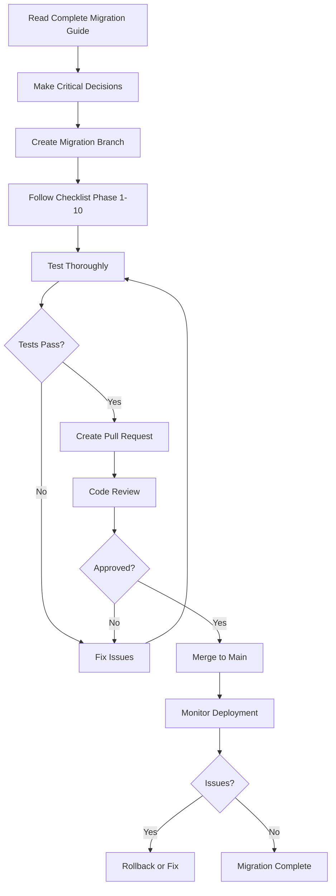

# One Page Author to Ink Stained Wretches Migration - Quick Start

## Overview

This migration renames all "One Page Author" references to "Ink Stained Wretches" throughout the codebase, aligning with the already-established branding used in deployed infrastructure.

## Documents in This Migration Package

### 1. 📋 [Migration Checklist](MIGRATION_CHECKLIST_ONE_PAGE_AUTHOR_TO_INK_STAINED_WRETCHES.md)

**Use this for execution** - Step-by-step checklist with checkboxes for tracking progress during the actual migration.

- 10 phases with detailed tasks
- Pre-flight checks
- Success criteria
- Rollback procedure
- Notes section for tracking issues

### 2. 📖 [Complete Migration Guide](MIGRATION_ONE_PAGE_AUTHOR_TO_INK_STAINED_WRETCHES.md)

**Reference documentation** - Comprehensive guide explaining the reasoning, scope, and details of every change.

- Detailed analysis of ~1,734 code occurrences
- Risk assessment and mitigation
- Database naming considerations
- Infrastructure impact analysis
- Effort estimation (22-44 hours)

## Quick Facts

| Metric | Value |
|--------|-------|
| **Code Occurrences** | ~1,734 |
| **Documentation References** | ~342 |
| **Projects to Rename** | 3 |
| **Project References to Update** | 20+ |
| **Estimated Effort** | 3-6 business days |
| **Recommended Team Size** | 2-3 developers |
| **Risk Level** | Medium (with proper planning) |

## Critical Decisions Needed

### 1. Database Naming Strategy

**Choose one approach:**

- ✅ **RECOMMENDED:** Keep database as "OnePageAuthorDb"
  - No data migration needed
  - Zero downtime
  - Only update code references and documentation
  
- ⚠️ **ALTERNATIVE:** Migrate database to "InkStainedWretchesDb"
  - Requires complex data migration
  - Potential downtime
  - Higher risk
  - More effort

### 2. Repository Rename

**Decide if GitHub repository should be renamed:**

- Current: `utdcometsoccer/one-page-author-page-api`
- Proposed: `utdcometsoccer/ink-stained-wretches-api`
- Impact: URLs, CI/CD, team clones (GitHub provides redirects)

## Execution Workflow



## Before You Start

### Prerequisites

- [ ] Read the complete [Migration Guide](MIGRATION_ONE_PAGE_AUTHOR_TO_INK_STAINED_WRETCHES.md)
- [ ] Get team approval
- [ ] Decide on database naming strategy
- [ ] Decide on repository rename
- [ ] Schedule migration window
- [ ] Create backup of current codebase
- [ ] Print or open the [Migration Checklist](MIGRATION_CHECKLIST_ONE_PAGE_AUTHOR_TO_INK_STAINED_WRETCHES.md)

### Tools Needed

- IDE with find/replace across solution (VS Code, Visual Studio, or Rider)
- Git command line or GUI
- .NET 10 SDK
- Azure CLI (for deployment verification)
- Access to CI/CD configuration

## Major Changes Summary

### Files and Directories

```
OLD                                    NEW
───────────────────────────────────   ──────────────────────────────────────
OnePageAuthorAPI.sln                  InkStainedWretchesAPI.sln
OnePageAuthorLib/                     InkStainedWretchesLib/
OnePageAuthor.Test/                   InkStainedWretches.Test/
OnePageAuthor.DataSeeder/             InkStainedWretches.DataSeeder/
```

### Namespaces

```csharp
// OLD
namespace OnePageAuthorLib.Api.Stripe
using OnePageAuthorLib.Interfaces.Stripe;

// NEW
namespace InkStainedWretchesLib.Api.Stripe
using InkStainedWretchesLib.Interfaces.Stripe;
```

### Commands

```bash
# OLD
dotnet build OnePageAuthorAPI.sln
dotnet test OnePageAuthorAPI.sln

# NEW
dotnet build InkStainedWretchesAPI.sln
dotnet test InkStainedWretchesAPI.sln
```

## Risk Mitigation

### High Priority

1. **Database naming decision** - Make before starting
2. **Project reference updates** - All 20+ must be correct
3. **Namespace changes** - Must be complete and consistent

### Testing Requirements

- ✅ Unit tests must pass
- ✅ Integration tests must pass
- ✅ Local build must succeed
- ✅ CI/CD pipeline must work
- ✅ Deployed functions must respond

### Rollback Plan

- Keep migration on separate branch until fully tested
- Don't merge to main until all tests pass
- Have previous deployment ready to restore if needed

## Common Pitfalls to Avoid

❌ **Don't:**

- Skip testing after each phase
- Rename files/folders before updating references
- Commit without verifying build succeeds
- Merge without code review
- Forget to update documentation

✅ **Do:**

- Follow the checklist order
- Test after each major change
- Use find/replace carefully (case-sensitive)
- Keep team informed
- Document any issues encountered

## Getting Help

### During Migration

1. Reference the [Complete Migration Guide](MIGRATION_ONE_PAGE_AUTHOR_TO_INK_STAINED_WRETCHES.md) for detailed explanations
2. Check the rollback procedure in the checklist if issues arise
3. Use the notes section in the checklist to track problems
4. Don't hesitate to pause and seek team input

### After Migration

- Monitor Application Insights for errors
- Check CI/CD pipeline logs
- Review Azure Function logs
- Be available to help team members update their local environments

## Success Indicators

✅ Migration is successful when:

1. Solution builds without errors
2. All tests pass (unit and integration)
3. CI/CD pipeline completes successfully
4. Deployed applications function correctly
5. Documentation is accurate
6. Team can develop locally
7. No critical production issues for 1 week

## Timeline

| Phase | Tasks | Estimated Time |
|-------|-------|----------------|
| **Planning** | Review docs, make decisions | 2-4 hours |
| **Execution** | Follow checklist Phases 1-7 | 16-24 hours |
| **Testing** | Build, test, verify | 4-8 hours |
| **Deployment** | PR, review, merge, deploy | 2-4 hours |
| **Monitoring** | Post-deployment verification | 2-4 hours |
| **Total** | | **26-44 hours** |

*Recommended: Spread across 3-6 business days with 2-3 developers*

## Next Steps

1. **Read** the [Complete Migration Guide](MIGRATION_ONE_PAGE_AUTHOR_TO_INK_STAINED_WRETCHES.md) (30-45 minutes)
2. **Schedule** team meeting to review and approve plan
3. **Decide** on critical questions (database naming, repository rename)
4. **Print/Open** the [Migration Checklist](MIGRATION_CHECKLIST_ONE_PAGE_AUTHOR_TO_INK_STAINED_WRETCHES.md)
5. **Create** migration branch and begin execution

---

## Document Information

- **Created:** January 15, 2026
- **Version:** 1.0
- **Status:** Planning Phase
- **Related Documents:**
  - [Complete Migration Guide](MIGRATION_ONE_PAGE_AUTHOR_TO_INK_STAINED_WRETCHES.md)
  - [Migration Checklist](MIGRATION_CHECKLIST_ONE_PAGE_AUTHOR_TO_INK_STAINED_WRETCHES.md)

---

**Ready to begin?** Start with Phase 1 in the [Migration Checklist](MIGRATION_CHECKLIST_ONE_PAGE_AUTHOR_TO_INK_STAINED_WRETCHES.md) after completing all prerequisites. Good luck! 🚀
